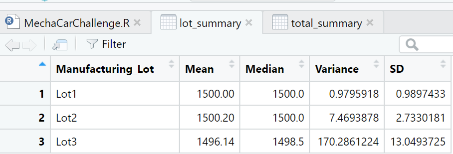
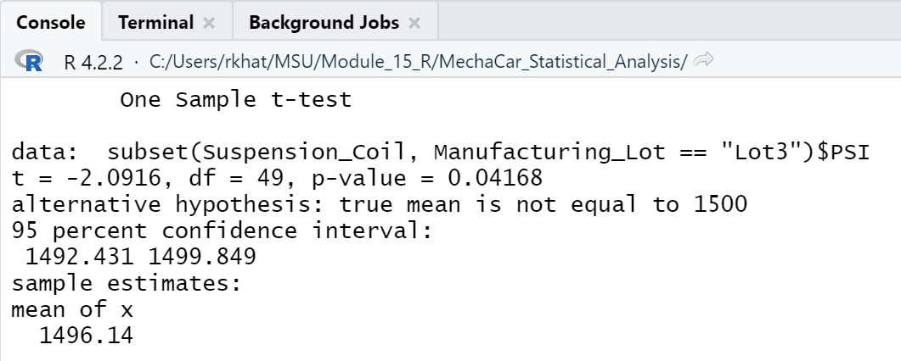

## MechaCar_Statistical_Analysis

* From the below screenshot of linear model, we can conclude that around 71% of MPG predictions of MechaCar prototypes will be correct when using this model. 

* The p-value result = 5.35e-11, so we can make a decision that for our data, the null hypothesis will be rejected.
* The vehicle length and ground clearance affect the way more than the vehicle weight and spoiler angle.
* The slope cannot be zero, for our linear model. 

## Summary Statistics on Suspension Coils

* The design specifications for the MechaCar suspension coils dictate that the variance of the suspension coils must not exceed 100 pounds per square inch.
* From the below screenshot, we can conclude that, the design specification does meet the current manufacturing data. The variance across all the three lots are at a 62.29

* When we compare all the three lots for the PSI of the suspension coils, the variance between Lot 1 & 2 meet the requirement of the suspension coil under 100 pounds per square inch. Lot 3 has variance of 170.2861 ( which equal to 170.29), which do not  meet the specs per the PSI.

## T-Tests on Suspension Coils

* The t-test that compares all the manufacturing lots against mean PSI of the population,  gives the p-value = 0.06, from which we can determine that we cannot reject the null hypothesis.

* The t-test for Lot 1 results in p-value = 1, which is above the significance level of 0.05 percent.

* The t-test for Lot 2 results in p-value = 0.60, which is also above the significance level of 0.05 percent.

* The t-test for Lot 3 results in p-value = 0.04, which is way below the significance level of 0.05 percent, which is a good reason to reject the null hypothesis.

## Study Design: MechaCar vs Competition

* When comparing the study design of MechaCar and the competition, the metrics that would be of interest to a consumer, from our dataset and findings can be :- 
city or highway fuel efficiency, safety rating, cost

* Most popular metric for consumer, to test would be the mileage/ fuel efficiency.
 The Null Hypothesis - MechaCars have no difference in fuel efficiency price, when compared to their competitors.
 The Alternative Hypothesis - MechaCars have different fuel efficiency price, when compared to their competitors.

* To run the statistical data, we would need more data like geographical locations, available transportation facilities, population in that location, etc.
